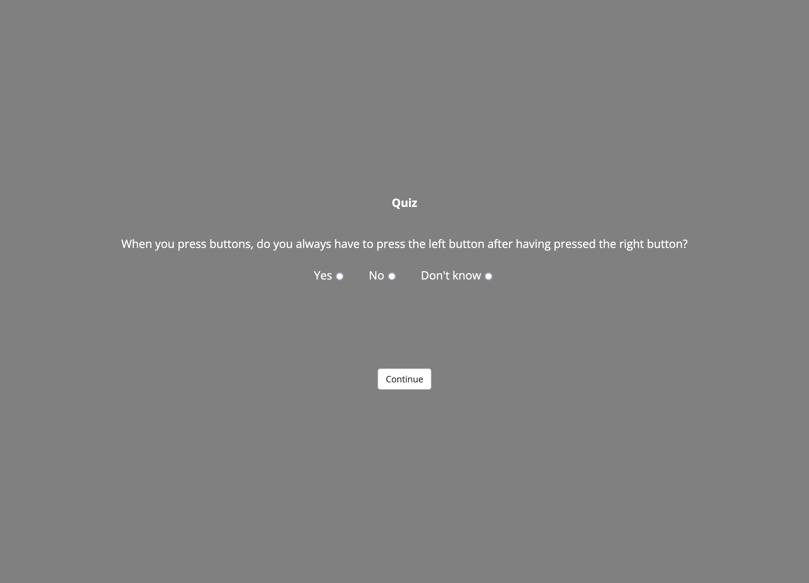
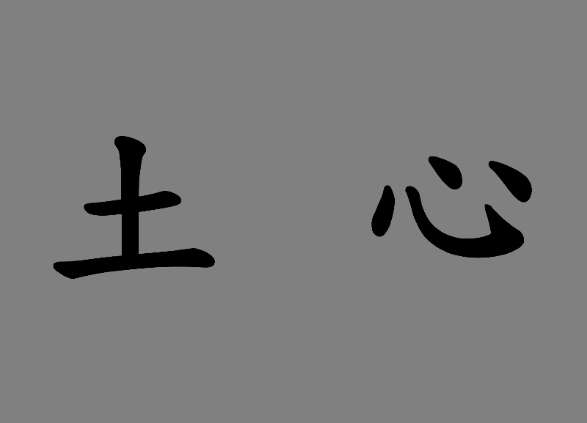

# Matthias' jsPsych plugins

Homepage: <https://ihrke.github.io/jspsych-plugins-mm/>

Github: <https://github.com/ihrke/jspsych-plugins-mm>

Matthias: <https://ihrke.github.io/>

**List of plugins**

| name                                                      | demo                                            | description                                                       |
|:----------------------------------------------------------|:------------------------------------------------|:------------------------------------------------------------------|
| [countdown-mm](#countdown-mm)                             | [link](example-countdown-mm.html)               | Display countdown in center of screen and finish once it is done. |
| [quiz-multi-choice-mm](#quiz-multi-choice-mm)             | [link](example-quiz-multi-choice-mm.html)       | Multiple-choice quiz. Only continue when answer is correct        |
| [gradient-feedback-mm](#gradient-feedback-mm)             | [link](example-gradient-feedback-mm.html)       | Present a feedback (value) in form of a colored gradient.         |
| [2afc-probreward-mm](#2afc-probreward-mm)                 | [link](example-2afc-probreward-mm.html)         | Present 2-AFC and give probabilistic reward afterwards.           |
| [gradient-feedback-multi-mm](#gradient-feedback-multi-mm) | [link](example-gradient-feedback-multi-mm.html) | Present multiple feedback (values) in form of colored gradients.  |
    
## countdown-mm

Display countdown in center of screen and finish once it is done.

[Demo](example-countdown-mm.html)

|                 | type                                 | pretty_name     | default   | description                                                             | options            |
|:----------------|:-------------------------------------|:----------------|:----------|:------------------------------------------------------------------------|:-------------------|
| countdown_max   | jsPsych.plugins.parameterType.INT    | Countdown       | 3         | Number to start counting down from.                                     | nan                |
| prompt          | jsPsych.plugins.parameterType.STRING | Prompt          | null      | Text to display along with the countdown.                               | nan                |
| prompt_location | jsPsych.plugins.parameterType.SELECT | Prompt location | above     | Indicates whether to show prompt "above" or "below" the countdown area. | ['above', 'below'] |
| duration        | jsPsych.plugins.parameterType.int    | Duration        | 1000      | Duration of each number of the countdown in milliseconds.               | nan                |

    
## quiz-multi-choice-mm

Multiple-choice quiz. Only continue when answer is correct

[Demo](example-quiz-multi-choice-mm.html)

|              | type                                 | array   | pretty_name      | nested   | prompt   | default   | description                                                                      |
|:-------------|:-------------------------------------|:--------|:-----------------|:---------|:---------|:----------|:---------------------------------------------------------------------------------|
| question     | jsPsych.plugins.parameterType.STRING | false   | Prompt           | {        | {        | undefined | The strings that will be associated with a group of options.                     |
| options      | jsPsych.plugins.parameterType.STRING | true    | Options          | nan      | nan      | undefined | Displays options for an individual question.                                     |
| horizontal   | jsPsych.plugins.parameterType.BOOL   | nan     | Horizontal       | nan      | nan      | false     | If true, then questions are centered and options are displayed horizontally.     |
| name         | jsPsych.plugins.parameterType.STRING | nan     | Question Name    | nan      | nan      |           | Controls the name of data values associated with this question                   |
| correct      | jsPsych.plugins.parameterType.STRING | nan     | Correct response | nan      | nan      |           | Indicates which response option is correct                                       |
| hint         | jsPsych.plugins.parameterType.STRING | nan     | Hint             | nan      | nan      |           | Hint that is displayed when an incorrect response is given                       |
| preamble     | jsPsych.plugins.parameterType.STRING | nan     | Preamble         | nan      | nan      | null      | HTML formatted string to display at the top of the page above all the questions. |
| button_label | jsPsych.plugins.parameterType.STRING | nan     | Button label     | nan      | nan      | Continue  | Label of the button.                                                             |

    
## gradient-feedback-mm

Present a feedback (value) in form of a colored gradient.

[Demo](example-gradient-feedback-mm.html)

|              | type                                 | pretty_name            | default   | description                                                        |
|:-------------|:-------------------------------------|:-----------------------|:----------|:-------------------------------------------------------------------|
| title        | jsPsych.plugins.parameterType.STRING | title for the scale    |           | A title/label put under the scale.                                 |
| start_color  | jsPsych.plugins.parameterType.STRING | Start color            | black     | Color for starting the gradient.                                   |
| end_color    | jsPsych.plugins.parameterType.STRING | End color              | red       | Color to end the gradient.                                         |
| left_label   | jsPsych.plugins.parameterType.STRING | Left anchor for scale  | low       | Can be any valid HTML, also an image.                              |
| right_label  | jsPsych.plugins.parameterType.STRING | Right anchor for scale | high      | Can be any valid HTML, also an image.                              |
| value        | jsPsych.plugins.parameterType.INT    | Value for feedback     | 0         | Value for feedback as number between 0 and 100.                    |
| width        | jsPsych.plugins.parameterType.INT    | Width of feedback box  | 700       | Width of feedback box in pixels.                                   |
| height       | jsPsych.plugins.parameterType.STRING | Height of feedback box | 80px      | Height of feedback box in CSS style (e.g., 500px or 20%).          |
| button_label | jsPsych.plugins.parameterType.STRING | Button label           | Continue  | The text that appears on the button to continue to the next trial. |

    
## 2afc-probreward-mm

Present 2-AFC and give probabilistic reward afterwards.

[Demo](example-2afc-probreward-mm.html)

|                      | type                                 | pretty_name                      | default                                              | description                                                                                              |
|:---------------------|:-------------------------------------|:---------------------------------|:-----------------------------------------------------|:---------------------------------------------------------------------------------------------------------|
| title                | jsPsych.plugins.parameterType.STRING | label/title                      |                                                      | A title/label put over the stimuli.                                                                      |
| stimuli              | jsPsych.plugins.parameterType.OBJECT | list of 2 stimuli                | {left: "A", right: "B                                | nan                                                                                                      |
| fixcross_duration    | jsPsych.plugins.parameterType.Object | duration of fixation cross       | [200, 500, 800]                                      | Duration the fixation cross (in ms); in case a list is provided, one of the elements is chosen randomly. |
| fixation_cross       | jsPsych.plugins.parameterType.STRING | fixation cross                   | 
+
   | Stimulus presented as fixation cross (HTML).                                                             |
| feedback_stimuli     | jsPsych.plugins.parameterType.OBJECT | list of 3 stimuli                | {positive: "good", negative: "bad", neutral: "missed | nan                                                                                                      |
| preward              | jsPsych.plugins.parameterType.OBJECT | probability of reward            | {left:0.7, right:0.3                                 | nan                                                                                                      |
| responses            | jsPsych.plugins.parameterType.OBJECT | list of 2 response buttons       | {left: "f", right: "j                                | nan                                                                                                      |
| width                | jsPsych.plugins.parameterType.STRING | width of each stimulus           | 100px                                                | in HTML-compatible units (px, %).                                                                        |
| distance             | jsPsych.plugins.parameterType.STRING | distance between stimuli         | 600px                                                | in HTML-compatible units (px, %).                                                                        |
| height               | jsPsych.plugins.parameterType.STRING | Height of stimuli                | 100px                                                | Height of stimuli box in CSS style (e.g., 500px or 20%).                                                 |
| highlight_duration   | jsPsych.plugins.parameterType.INT    | duration highlighted stimulus    | 200                                                  | Duration the selected stimulus is highlighted (in ms).                                                   |
| feedback_duration    | jsPsych.plugins.parameterType.INT    | duration feedback                | 200                                                  | Duration the feedback/reward is presented (in ms).                                                       |
| max_decision_time    | jsPsych.plugins.parameterType.INT    | max time for decision            | 1700                                                 | Maximum time for making decision (in ms).                                                                |
| total_trial_duration | jsPsych.plugins.parameterType.INT    | Total duration of trial          | 3300                                                 | Total trial duration (fixcross, decision, highlight, feedback, rest) in ms.                              |
| border_style         | jsPsych.plugins.parameterType.STRING | Style of border for highlighting | 2px solid black                                      | given as CSS border-style "thickness style color".                                                       |

    
## gradient-feedback-multi-mm

Present multiple feedback (values) in form of colored gradients.

[Demo](example-gradient-feedback-multi-mm.html)

|              | type                                 | pretty_name                                             | default   | description                                                           |
|:-------------|:-------------------------------------|:--------------------------------------------------------|:----------|:----------------------------------------------------------------------|
| titles       | jsPsych.plugins.parameterType.OBJECT | array of titles for subscales                           | Array()   | An array of strings with titles for each sub-scale                    |
| start_colors | jsPsych.plugins.parameterType.OBJECT | Start color(s)                                          | black     | Array of colors for starting the gradient (or single name of color).  |
| end_colors   | jsPsych.plugins.parameterType.OBJECT | End color(s)                                            | red       | Array of colors for ending the gradient (or single name of color).    |
| left_labels  | jsPsych.plugins.parameterType.OBJECT | Left anchor for scales                                  | low       | Can be any valid HTML, also an image.                                 |
| right_labels | jsPsych.plugins.parameterType.OBJECT | Right anchor for scales                                 | high      | Can be any valid HTML, also an image.                                 |
| values       | jsPsych.plugins.parameterType.OBJECT | Values for feedback                                     | Array()   | Array of values for feedback as numbers between 0 and 100.            |
| width        | jsPsych.plugins.parameterType.INT    | Width of feedback box                                   | 700       | Width of feedback box in pixels.                                      |
| height       | jsPsych.plugins.parameterType.STRING | Height of feedback box                                  | 80px      | Height of feedback box in CSS style (e.g., 500px or 20%).             |
| opacities    | jsPsych.plugins.parameterType.OBJECT | Opacities for the scales (to grey out individual ones). | 1         | Array of opacity-values for the scales or a single number bw 0 and 1. |
| button_label | jsPsych.plugins.parameterType.STRING | Button label                                            | Continue  | The text that appears on the button to continue to the next trial.    |
