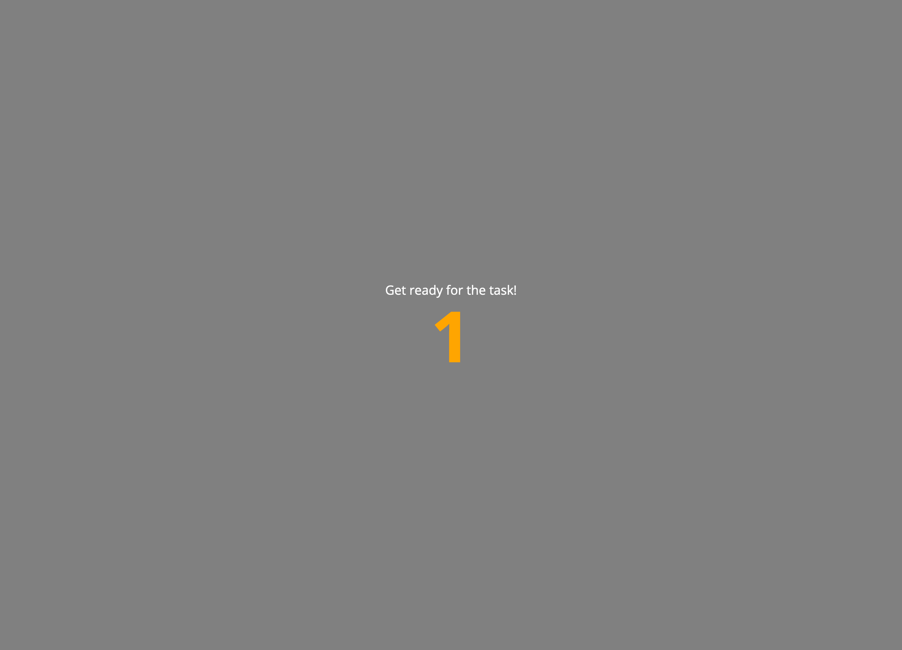
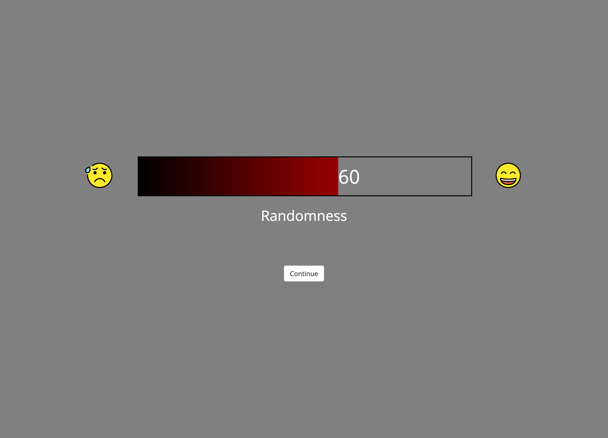
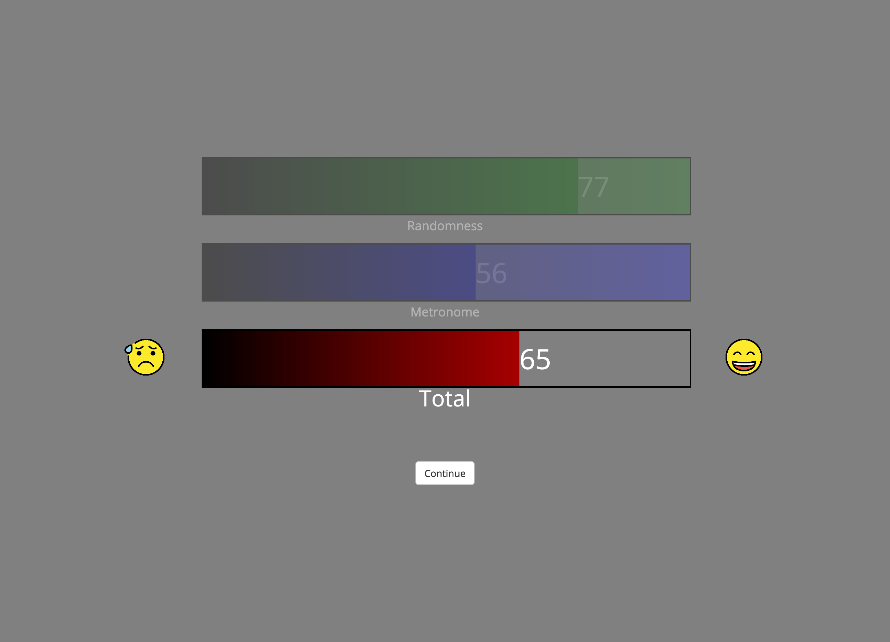

# jsPsych plugins

    
## countdown-mm
</img> 

Display countdown in center of screen and finish once it is done.

[Demo](example-countdown-mm.png)

|                 | type                                 | pretty_name     | default   | description                                                             | options            |
|:----------------|:-------------------------------------|:----------------|:----------|:------------------------------------------------------------------------|:-------------------|
| countdown_max   | jsPsych.plugins.parameterType.INT    | Countdown       | 3         | Number to start counting down from.                                     | nan                |
| prompt          | jsPsych.plugins.parameterType.STRING | Prompt          | null      | Text to display along with the countdown.                               | nan                |
| prompt_location | jsPsych.plugins.parameterType.SELECT | Prompt location | above     | Indicates whether to show prompt "above" or "below" the countdown area. | ['above', 'below'] |
| duration        | jsPsych.plugins.parameterType.int    | Duration        | 1000      | Duration of each number of the countdown in milliseconds.               | nan                |

    
## gradient-feedback-mm
</img> 

Present a feedback (value) in form of a colored gradient.

[Demo](example-gradient-feedback-mm.png)

|              | type                                 | pretty_name            | default   | description                                                        |
|:-------------|:-------------------------------------|:-----------------------|:----------|:-------------------------------------------------------------------|
| title        | jsPsych.plugins.parameterType.STRING | title for the scale    |           | A title/label put under the scale.                                 |
| start_color  | jsPsych.plugins.parameterType.STRING | Start color            | black     | Color for starting the gradient.                                   |
| end_color    | jsPsych.plugins.parameterType.STRING | End color              | red       | Color to end the gradient.                                         |
| left_label   | jsPsych.plugins.parameterType.STRING | Left anchor for scale  | low       | Can be any valid HTML, also an image.                              |
| right_label  | jsPsych.plugins.parameterType.STRING | Right anchor for scale | high      | Can be any valid HTML, also an image.                              |
| value        | jsPsych.plugins.parameterType.INT    | Value for feedback     | 0         | Value for feedback as number between 0 and 100.                    |
| width        | jsPsych.plugins.parameterType.INT    | Width of feedback box  | 700       | Width of feedback box in pixels.                                   |
| height       | jsPsych.plugins.parameterType.STRING | Height of feedback box | 80px      | Height of feedback box in CSS style (e.g., 500px or 20%).          |
| button_label | jsPsych.plugins.parameterType.STRING | Button label           | Continue  | The text that appears on the button to continue to the next trial. |

    
## gradient-feedback-multi-mm
</img> 

Present multiple feedback (values) in form of colored gradients.

[Demo](example-gradient-feedback-multi-mm.png)

|              | type                                 | pretty_name                                             | default   | description                                                           |
|:-------------|:-------------------------------------|:--------------------------------------------------------|:----------|:----------------------------------------------------------------------|
| titles       | jsPsych.plugins.parameterType.OBJECT | array of titles for subscales                           | Array()   | An array of strings with titles for each sub-scale                    |
| start_colors | jsPsych.plugins.parameterType.OBJECT | Start color(s)                                          | black     | Array of colors for starting the gradient (or single name of color).  |
| end_colors   | jsPsych.plugins.parameterType.OBJECT | End color(s)                                            | red       | Array of colors for ending the gradient (or single name of color).    |
| left_labels  | jsPsych.plugins.parameterType.OBJECT | Left anchor for scales                                  | low       | Can be any valid HTML, also an image.                                 |
| right_labels | jsPsych.plugins.parameterType.OBJECT | Right anchor for scales                                 | high      | Can be any valid HTML, also an image.                                 |
| values       | jsPsych.plugins.parameterType.OBJECT | Values for feedback                                     | Array()   | Array of values for feedback as numbers between 0 and 100.            |
| width        | jsPsych.plugins.parameterType.INT    | Width of feedback box                                   | 700       | Width of feedback box in pixels.                                      |
| height       | jsPsych.plugins.parameterType.STRING | Height of feedback box                                  | 80px      | Height of feedback box in CSS style (e.g., 500px or 20%).             |
| opacities    | jsPsych.plugins.parameterType.OBJECT | Opacities for the scales (to grey out individual ones). | 1         | Array of opacity-values for the scales or a single number bw 0 and 1. |
| button_label | jsPsych.plugins.parameterType.STRING | Button label                                            | Continue  | The text that appears on the button to continue to the next trial.    |
